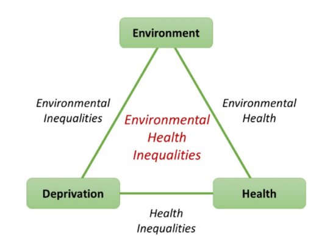
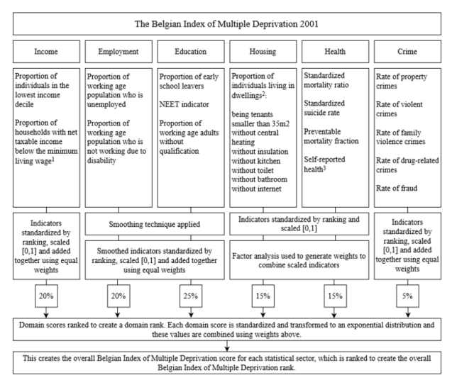

class: inverse, center, middle

```{r setup, include=FALSE}
knitr::opts_chunk$set(fig.retina = 3, fig.width = 6, fig.asp = 0.618, out.width = "70%", fig.align = "center", warning = FALSE, message = FALSE, echo = FALSE)

packages <- c("tidyverse", "ggplot2", "HMDHFDplus", "viridis", "scales",
              "forecast", "cowplot", "RColorBrewer", "raster", "spdep",
              "broom", "leaflet")
invisible( lapply(packages, library, character.only = TRUE))

```

# Quantifying spatial inequalities in cause-specific mortality

## A Bayesian hierarchical spatial model estimating cause-specific SMRs for Belgian municipalities

.large[Benjamin Schlüter<br/>Martina Otavova<br/>Bruno Masquelier<br/>Brecht Devleesschauwer]

<br/>

.large[BSPS 2022 | 7 Sep 2022]

<br/>

```{r out.width = '30%'}
# logo needs to be both in wd and where .Rmd is located
knitr::include_graphics("logo_UCL2.png")
```


---

# Context

```{r ellis, out.width = '40%'}
# logo needs to be both in wd and where .Rmd is located

```
.center[.link-email[[ELLIS project](https://www.brain-ellis.be)]]


???

* Conceptual framework

   * 3 dimensions to study environmental health inequalities
   
      * Socioeconomic deprivation
      
      * Environmental exposure
      
      * Health outcomes
      
Pairwise integration of these dimensions gives rise to three concepts

   * Health inequalities
   
   * Environmental inequalities
   
   * Environmental health
  
Integration of all three: environmental health inequalities 

--

.highlight[Methodological challenges:]

* Socio-economic deprivation and environmental stressors `r fontawesome::fa("arrow-right")` small-scale
  
* Associations might differ by cause of death

--

`r fontawesome::fa("arrow-right")` Cause-specific mortality estimates at small geographical level

.center[`r fontawesome::fa("exclamation")` High stochasticity in death counts  `r fontawesome::fa("exclamation")`]
 


---

class: inverse, center, middle

# Research questions:

.left[
# 1. Explore cause-specific mortality at the municipality level in Belgium

# 2. Assess its association with socio-economic deprivation and environmental stressors
]


---

# Data

### Cause-specific mortality  

* Aggregate-level data from Belgian national civil register 

* Cause of death certificates (ICD10 classification) 

   * Aggregated into 13 broad causes of death 

`r fontawesome::fa("arrow-right")` Cause-specific death counts and population counts by 5 year age group (1, 5, 10, ..., 95+), sex and municipality (589) aggregated over 2006-2016

### Covariates

* Environmental stressors (noise, air pollution, ...)

* Belgian index of multiple deprivation (BIMD) 2011 


---

# Belgian index of multiple deprivation (BIMD)

.pull-left[
```{r bimd_logo, out.width = "100%"}
# logo needs to be both in wd and where .Rmd is located

```
]

.pull-right[

<br/>

<br/>

`r fontawesome::fa("arrow-right")` __M. Otavova et al.__ (forthcoming)
]

<br/>

* BIMD score (without health domain) of each municipality in 2011 


---

# Methodology

.pull-left[
### Standardized Mortality Ratios

Municipality $i$, gender $s$ and CoD $a$,

$SMR^{i} = \frac{obs.~deaths^{{i}}}{exp.~deaths^{{i}}}$

$exp.~deaths^{i} = \sum{}_nM_x^{Nat} \cdot {}_nE_x^{i}$

<br/>

<br/>

`r fontawesome::fa("plus")` Control for differences in age structure

`r fontawesome::fa("plus")` Relative measure

`r fontawesome::fa("minus")` .highlight[Dominated by __sampling variability__]

]

--

.pull-right[
### BYM2 Poisson model

Municipality $i$, gender $s$ and CoD $a$,

$obs.~deaths^{i} \sim Poi(\theta^{i} \cdot exp.~deaths^{i})$

$log(\theta_i) = \mu + \boldsymbol{x_i\beta} + \phi_i + u_i$

$\phi_i \sim ICAR ~ model$

$u_i \sim N(0, \sigma_u^2)$

<br/>

`r fontawesome::fa("plus")` Covariates

`r fontawesome::fa("plus")` .highlight[__Smoothing__ SMRs with hierachical model]
]


???

* Combine two elements

* Raw SMRs


---
class: inverse, center, middle

# Preliminary results


---

# National cause-specific mortality rates

```{r nat_mx, out.width = "110%"}
# Load data
df <- readRDS("../../server/out/df_bym2.rda")

# Period considered
period <- 2006:2016
# Ages considered
ages <- as.character(c(1, seq(5, 95, 5)))

df.nat <- df %>% 
        filter(year %in% period,
               # premature mortality 1-74
               age %in% ages,
               # Breast cancer considered only for female
               !(sex == "m" & ICD_gp == "Breast_cancer")) %>% 
        group_by(age, sex, ICD_gp) %>% 
        summarise(dth = sum(dth),
                  exp = sum(exp)) %>% 
        ungroup() %>%
        mutate(mx = dth/exp)

library(directlabels)
df.nat %>% 
        mutate(sex = ifelse(sex == "f", "female", "male"),
               ICD_gp = gsub("_", " ", ICD_gp),
               age = as.character(age) %>% as.numeric()) %>% 
        filter(ICD_gp != "Other causes") %>% 
        ggplot(aes(x = age, y = mx, group = ICD_gp)) +
        facet_wrap(~ sex) +
        geom_line(aes(color = ICD_gp), size = 1.5) +
        geom_dl(aes(label = ICD_gp, col = ICD_gp), 
                method = list(dl.combine("last.bumpup"), cex = 0.6)) +
        scale_colour_viridis_d(guide="none") +
        theme_bw() +
        theme(legend.position = "bottom",
              axis.title.x = element_blank(),
              plot.title = element_text(hjust = 0.5, face = "bold"),
              strip.text = element_text(size = 13, face = "bold")
              ) +
        scale_y_log10(expand=expansion(add = c(0, 6e-01))) +
        scale_x_continuous(expand=expansion(add = c(0, 70)),
                           limits = c(1, 95), breaks = c(1, seq(15, 75, 15), 95)) +
        labs(y = expression(" "[n] * "M"[x]^{"Nat"} * " (log-scale)",),
             x = "Age") 

```

$$exp.~deaths^{i} = \sum{}_nM_x^{Nat} \cdot {}_nE_x^{i}$$


???

* Show burden of 13 broad causes of death


---

# Raw cause-specific SMRs

```{r raw_smr, out.width = "100%"}
df.smr <- df %>% 
        filter( # Aggregate over 9 y period 2007-2015
                year %in% period,
                # only premature mortality 1-74 ?
                age %in% ages,
                !(sex == "m" & ICD_gp == "Breast_cancer")) %>% 
        mutate(age = droplevels(age)) %>% 
        # Compute national CoD mortality
        group_by(age, sex, ICD_gp,
                 .drop = FALSE)  %>% 
        mutate(D = sum(dth),
               E = sum(exp), 
               Mx = D/E) %>% 
        ungroup() %>% 
        # Apply national level mortality
        mutate(exp_dth = Mx*exp) %>% 
        group_by(ICD_gp, sex, comm,
                 .drop = FALSE) %>% 
        summarise(obs_dth = sum(dth),
                  exp_dth = sum(exp_dth)) %>% 
        ungroup() %>% 
        mutate(smr = obs_dth/exp_dth)

ICD_gp.sel <- c("Alcohol_related", "Cardiovascular_diseases", 
                "Lung_cancer", "Colorectal_cancer")
df.smr %>% 
        filter(comm != "73028",
               ICD_gp %in% ICD_gp.sel) %>% 
        mutate(sex = ifelse(sex == "f", "female", "male"),
               ICD_gp = gsub("_", " ", ICD_gp)) %>% 
        ggplot(aes(x = log(exp_dth), y = smr, col = sex)) +
        facet_wrap(~ ICD_gp, scales = "free") +
        geom_point(alpha = 0.2) +
        scale_color_viridis_d(option = "E", begin = 0.1, end = 0.8) +
        theme_bw() +
        theme(legend.position = "top",
              legend.direction = "horizontal") +
  labs(y = "SMR",
       x = "Expected deaths (log-scale)",
       col = "Gender") 
```

* High SMRs for low expected deaths $\propto$ pop. size `r fontawesome::fa("arrow-right")` sampling variability


---

# Smoothed SMRs

### Cardiovascular diseases, male

```{r map_cardio_m, out.width = "80%"}
knitr::include_graphics("../../figures/maps/Cardiovascular_diseases_m.png")
```


---

# Smoothed SMRs

### Cerebrovascular diseases and HTA, male

```{r map_cerebro_m, out.width = "80%"}
knitr::include_graphics("../../figures/maps/Cerebrovascular_diseases_and_HTA_m.png")
```


---

# Smoothed SMRs

### Non transport accidents, male

```{r map_non_transport_m, out.width = "80%"}
knitr::include_graphics("../../figures/maps/Non_transport_accidents_m.png")
```


???

* Different spatial pattern across cause of death


---

# Smoothed SMRs

### Lung cancer, female

```{r map_lung_m, out.width = "80%"}
knitr::include_graphics("../../figures/maps/Lung_cancer_f.png")
```


???

* What about uncertainty? `r fontawesome::fa("arrow-right")` Posterior prob. of exceedance


---

# Posterior probability of SMRs exceeding 1.3 

### Lung cancer, female

```{r map_exc_p_lung_f}
knitr::include_graphics("../../figures/maps/exceedance_prob_lung_cancer_f.png")
```

* Interesting metric to identify and target municipalities


---

# Cardiovascular diseases, female

```{r credible intervals, out.width = "95%"}
df.smr.cardio <- readRDS("../../server/out/estimates/df_smr_Cardiovascular_diseases_f.rda")

df.smr.cardio %>% 
        ggplot(aes(y = fct_reorder(comm, median))) +
        # geom_pointrange(aes(x=median, xmin=lower, xmax=upper)) +
        geom_linerange(aes(xmin = lower95, xmax = upper95), 
                       col = "skyblue1", alpha = 0.3) +
        geom_point(aes(x = median), col = "skyblue3") +
        geom_vline(xintercept = 1, linetype = "dashed") +
        theme_bw() +
        theme(axis.text.y = element_blank(),
              axis.ticks.y = element_blank(),
              panel.grid.major = element_blank(), 
              panel.grid.minor = element_blank()) +
        labs(y = "Municipality",
             x = "SMR") +
        annotate(geom = "point", x = 1.4, y = 200, col = "skyblue3") +
        annotate(geom = "text", x = 1.42, y = 200, hjust = 0,
                 label = "Posterior median") +
        annotate(geom = "segment", 
                 x = 1.39, xend = 1.41, y = 170, yend = 170, 
                 col = "skyblue1") +
        annotate(geom = "text", x = 1.42, y = 170, hjust = 0,
                 label = "95% Credible interval") 
  

  

```


* Difficult to differentiate between municipalities except between the extremes

---

# Cause-specific SMR variances

```{r var_comp, out.width = "100%"}
df.sigma <- readRDS("../../estimates/df_sigma.rda")

df.sigma %>%
        mutate(across(lower95:upper95, ~ exp(.x)),
               ICD_gp = ifelse(ICD_gp == "Suicide_code", "Suicide", ICD_gp),
               ICD_gp = gsub("_", " ", ICD_gp),
               sex = ifelse(sex == "f", "female", "male")) %>%
        filter(model == "BYM2 no bimd",
               ICD_gp != "Other causes") %>%
        ggplot(aes(y = fct_reorder(ICD_gp, median))) +
        geom_pointrange(aes(x=median, xmin=lower95, xmax=upper95, col = sex),
                        position = position_dodge(width = 0.55)) +
        theme_bw() +
        theme(legend.position = c(0.75, 0.3),
              axis.title.y = element_blank()) +
        scale_color_viridis_d(begin = 0, end = 0.5) +
        labs(x = "Variance",
             col = "Gender")

 

```


---

# Ecological association with BIMD score

```{r bimd, out.width = "100%"}

CoDs <- unique(df.smr$ICD_gp)
df.beta <- data.frame()

# Exctract beta1 and store in df
for (c in CoDs) {
  for (sx in c("m", "f")) {
    if (!(c == "Breast_cancer" & sx == "m")) {
      
      
      beta1 <- readRDS(paste0("../../server/out/estimates/beta1_", c, "_", sx,  ".rda"))
      temp <- data.frame(ICD_gp = c,
                         sex = sx,
                         median = beta1[2],
                         lower95 = beta1[1],
                         upper95 = beta1[3])
      df.beta <- rbind(df.beta, temp)
    }
  }
}
df.beta %>% 
  filter(ICD_gp != "Other causes") %>% 
  mutate(sign = ifelse(lower95 > 1 & upper95 > 1 |
                       lower95 < 1 & upper95 < 1, "yes", "no"),
         ICD_gp = ifelse(ICD_gp == "Suicide_code", "Suicide", ICD_gp),
         ICD_gp = gsub("_", " ", ICD_gp),
         across(median:upper95, ~ (.x-1)*100),
         sex = ifelse(sex == "f", "female", "male")) %>% 
  ggplot(aes(y = fct_reorder(ICD_gp, median))) +
        geom_pointrange(aes(x=median, xmin=lower95, xmax=upper95, col =  sex),
                        position = position_dodge(width = 0.55)) +
        geom_vline(xintercept = 0, linetype = "dashed") +
        theme_bw() +
        theme(legend.position = c(0.75, 0.3),
              axis.title.y = element_blank()) +
        scale_color_viridis_d(begin = 0, end = 0.5) +
        labs(x = "% increase in SMR by point increase in BIMD score",
             col = "Gender")
  


# df.sigma %>% 
#         mutate(across(lower95:upper95, ~ exp(.x)),
#                ICD_gp = gsub("_", " ", ICD_gp),
#                sex = ifelse(sex == "f", "female", "male")) %>% 
#         filter(model != "Poisson-Lognormal") %>% 
#   ggplot(aes(y = fct_reorder(ICD_gp, median))) +
#   facet_wrap(~ sex) +
#   geom_pointrange(aes(x=median, xmin=lower95, xmax=upper95, col = model),
#                         position = position_dodge(width = 0.55)) +
#         theme_bw() +
#         theme(legend.position = c(0.35, 0.3),
#               axis.title.y = element_blank()) +
#         scale_color_viridis_d(begin = 0.4, end = 0.8) +
#         labs(x = "Variance",
#              col = "Model")

```


???

* For every point increase in deprivation score, the relative risk increases by x%


---

# Limitations

* Ecological associations 

* Broad time window

* Poor classification of causes of death at old ages

* Regional differences in certifying/coding practices

# Next steps

* Incorporate environmental stressors

* Sensitivity analysis (prior, time window)


---
class: inverse, center, middle

# Thank you for your attention !

<br/>
<br/>

.left[
`r fontawesome::fa("at")` .link-email[[benjamin-samuel.schluter@uclouvain.be](benjamin-samuel.schluter@uclouvain.be)]

`r fontawesome::fa("slideshare")` .link-email[[http://benjisamschlu.github.io/BSPS2022-cause-specific-SMR/slides.html](http://benjisamschlu.github.io/BSPS2022-cause-specific-SMR/slides.html)]

`r fontawesome::fa("github")` .link-email[[@benjisamschlu](https://github.com/benjisamschlu)]
]